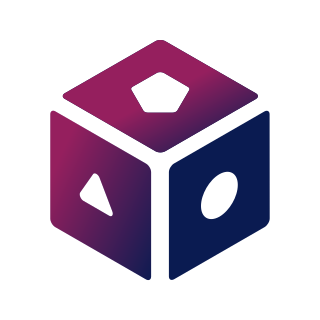
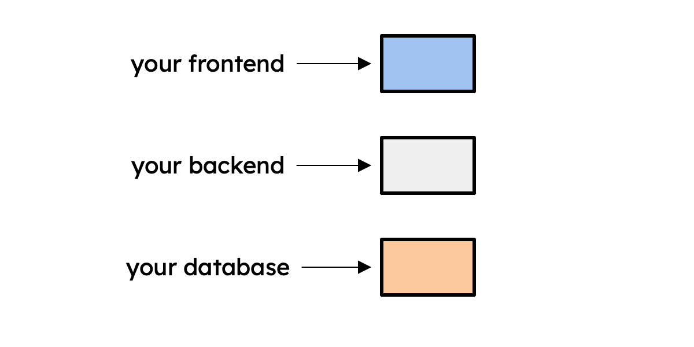
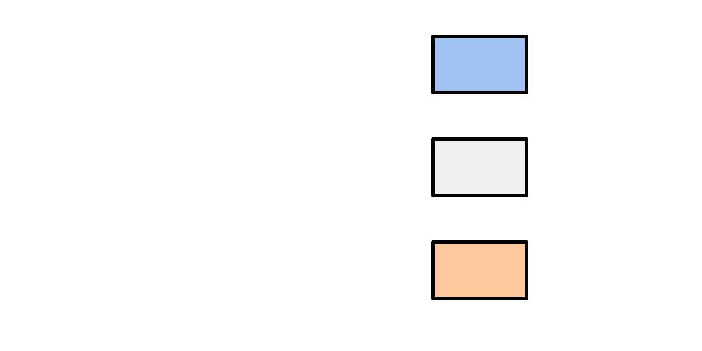
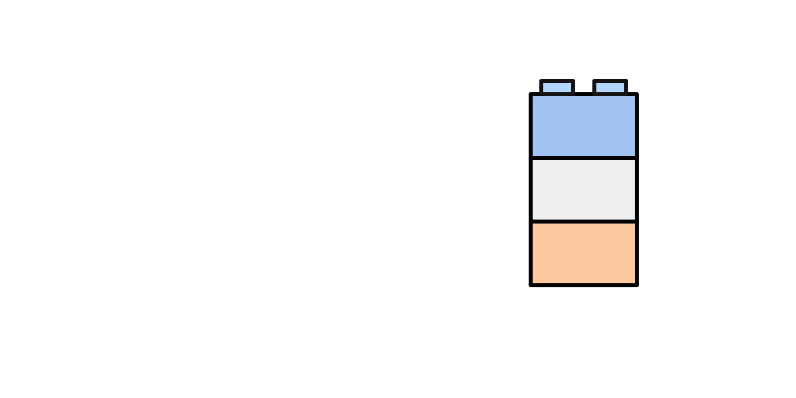
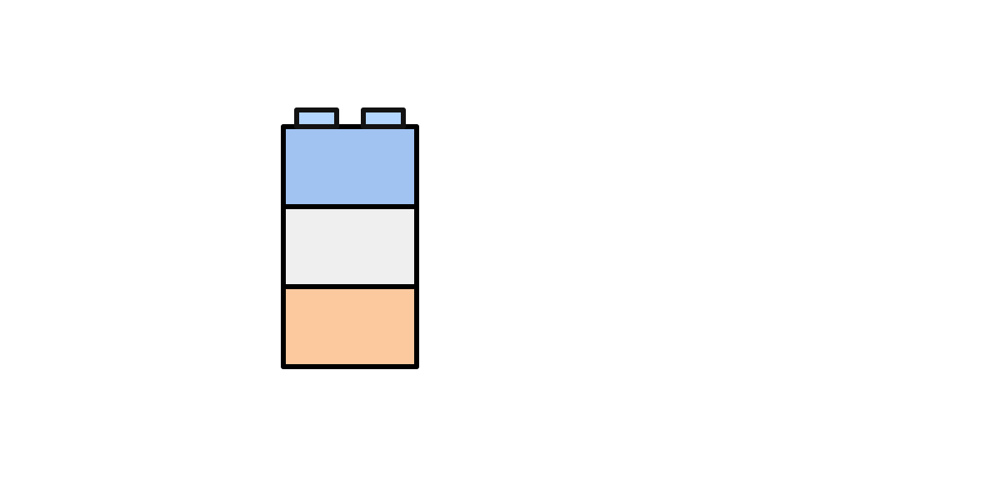
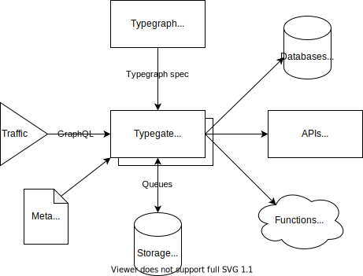

    

    <h3 align="center">
        <a href="https://metatype.dev/docs/tutorials/getting-started?utm_source=github&utm_medium=readme&utm_campaign=metatype">Getting started</a> • <a href="https://metatype.dev/docs/concepts/overview?utm_source=github&utm_medium=readme&utm_campaign=metatype">Docs</a> • <a href="https://metatype.dev/use-cases/automatic-crud-validation?utm_source=github&utm_medium=readme&utm_campaign=metatype">Use cases</a> • <a href="https://github.com/metatypedev/metatype/discussions">Community</a>
    </h3>

Support us by <a href="https://github.com/metatypedev/metatype/stargazers">starring</a> ⭐ this repository, joining the community on
<a href="https://github.com/metatypedev/metatype/discussions">discussions</a> 💬, subscribing to
<a href="https://github.com/metatypedev/metatype/releases">releases</a> 🔔, requesting a
<a href="https://github.com/metatypedev/metatype/issues">feature</a> 💡 or even making a
<a href="https://github.com/metatypedev/metatype/pulls">contribution</a> :octocat:.

    
    
    

<h1 align="center"><a href="https://metatype.dev/?utm_source=github&utm_medium=readme&utm_campaign=metatype">Metatype</a> • declarative API development platform</h1>

<table>
    <tr>
        <td>
            <h3>Programming is like castle building</h3>
            
And castle building is hard. Even the best teams can struggle to build according to the plans, especially with the ever evolving needs and the tech landscape complexities.

        </td>
        <td>
            
        </td>
    </tr>
    <tr>
        <td>
            
        </td>
        <td>
            <h3>Build stable castle with typegraphs</h3>
            
Typegraphs are programmable virtual graphs describing all the components of your stack. They enable you to compose APIs, storage and business logic in a type safe manner.

        </td>
    </tr>
    <tr>
        <td>
            <h3>Build modulable castle with typegate</h3>
            
Typegate is a distributed GraphQL/REST query engine that compiles, optimizes, runs and caches queries over typegraphs. It enforces authentication, authorization and security for you.

        </td>
        <td>
            
        </td>
    </tr>
    <tr>
        <td>
            
        </td>
        <td>
            <h3>Build reusable castle with Metatype</h3>
            
Install third parties as dependencies and start reusing components. The Meta CLI offers you live reloading and one-command deployment to Metacloud or your own instance.

        </td>
    </tr>
</table>

<a href="#top">back to top ↑</a>

## Overview and motivations

Metatype is an open source platform for developers to **declaratively build
APIs**. It offers a unique approach to building backends, where the focus is all
on data modelling and the platform takes care of the rest.

The intent is to find a convenient computing model that tackles the following
challenges:

- most developers still spend too much time on tasks with low-value (crud, data
  validation, compliance, etc.)
- when growing a product, it is hard to keep up with business needs and remain
  innovative with technology
- managing server and infrastructure shall never be a concern for developers nor
  slow them down

In that respect, Metatype can be seen as an alternative to Hasura, Strapi,
Firebase, or even web frameworks like Django or NestJS. You can see how Metatype
differs reading the
[conceptual overview](https://metatype.dev/docs/concepts/overview) or the
[comparison summary](https://metatype.dev/docs/concepts/comparisons).

The platform consists of the following components:

- [**Typegraph**](https://metatype.dev/docs/concepts/typegraph): a package to
  describe typegraphs - virtual graphs of types - and compose them
- [**Typegate**](https://metatype.dev/docs/concepts/typegate): a distributed
  REST/GraphQL query engine to execute queries over typegraphs
- [**Meta CLI**](https://metatype.dev/docs/concepts/meta-cli): a command-line
  tool to provide great developer experience and serverless deployment

A vast range of [runtimes](https://metatype.dev/docs/reference/runtimes) is
implemented by the platform and provides out of the box support for storing data
in databases/S3, connecting to third-party/internal APIs and running business
logic in Deno/Python/WebAssembly.

    

    <h3 align="center">
Browse the
<a href="https://metatype.dev?utm_source=github&utm_medium=readme&utm_campaign=metatype">documentation</a>
or start directly
<a href="https://metatype.dev/docs/tutorials/getting-started?utm_source=github&utm_medium=readme&utm_campaign=metatype">building your first typegraph</a>!
    </h3>

<a href="#top">back to top ↑</a>

## Development status

Metatype is in beta and some interfaces still need to be stabilized, yet most of
the core of the engine is close to production readiness. As such, it does
**not** follow semantic versioning until the first stable release, and all
changes will be explicitly outlined in the
[changelog](https://github.com/metatypedev/metatype/releases) (watch/subscribe
to this repository to be notified).

<a href="#top">back to top ↑</a>

## Contributing

If you have an idea or a suggestion that would make this better, please fork the
repository and follow the step below to create a pull request. You can also
simply open an issue with the tag "enhancement".

1. Fork the repository
2. Clone your fork and follow the
   [developer setup](https://metatype.dev/docs/guides/contributing)
3. Create a feature branch: `git checkout -b feature/awesome-x`
4. Commit your changes using
   [conventional commits](https://www.conventionalcommits.org):
   `git commit -am 'feat: add awesome x'`
5. Push to the branch: `git push origin feature/awesome-x`
6. Open a pull request

First-time contributors can find a list of
[friendly issues](https://github.com/metatypedev/metatype/issues?q=is%3Aissue+is%3Aopen+label%3A%22good+first+issue%22)
for them to get started and discover step by step the platform.

<a href="#top">back to top ↑</a>

## License

Copyright © Metatype OÜ. Distributed under various licenses, see
[LICENSE](./license.md) for the details. Contributions are welcomed and subject
to Contributor License Agreement (CLA).

<a href="#top">back to top ↑</a>

