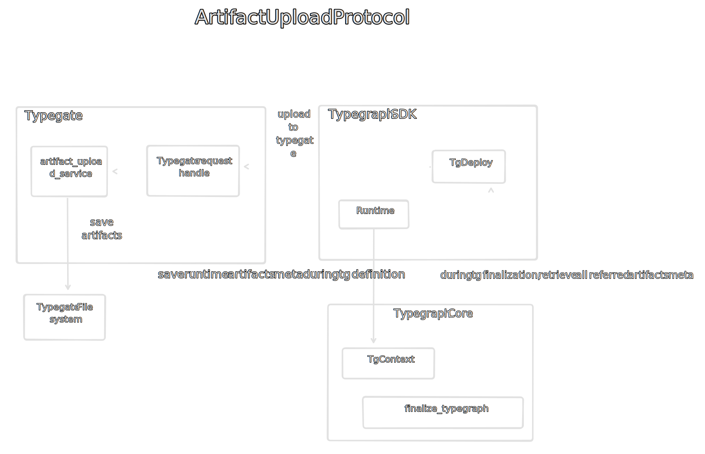

# Artifact storage

## Artifact upload

Artifacts are uploaded according to the upload protocol.

[TODO: update diagram]

## Reference count

Artifacts are tracked using reference counts. After a successful upload, each artifact is assigned a zero reference count.

When a typegraph is deployed for the first time, the reference counts associated
to each of its artifacts are incremented.

When a typegraph is updated, reference counts are updated according to the diff
of the artifact list between new and old versions of the typegraph (sorted list
of artifact hashes): removal -> decrementation, addition -> incrementation, no
change -> no change.

When a typegraph is undeployed, the reference count of each artifact associated
to the typegraph is decremented.

### Rationale

Why do we use reference counts instead of removing unused artifacts after each
typegraph update/undeployment?

- Artifacts are shared between typegraphs: multiple typegraphs from a single
  projects might share the same artifacts.
- We might have orphaned artifacts due to uncompleted typegraph process.

## Artifact removal

### GC: Garbage collection

Artifacts that have a zero reference count are removed.

**Triggers:** The GC is triggerred at the end of each typegraph
deployment/undeployment process.

### Full GC

**_Not implemented_**

A full GC can be triggered manually. It recomputes all the reference counts then
run the GC.

It might be necessary as the reference count might get wrong due to lack of a
proper transaction support for the typegraph deployment/undeployment process.
