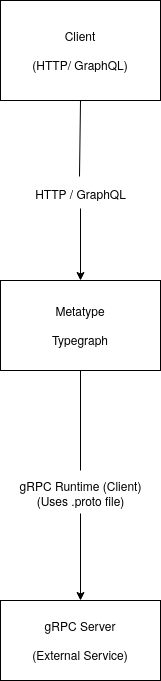

# Introducing gRPC Runtime

We're excited to announce the new gRPC Runtime feature in Metatype, further enhancing our platform's ability to create versatile and powerful backends through typegraphs.

## What is gRPC?

gRPC, or **g**oogle **R**emote **P**rocedure **C**all, is a high-performance, open-source communication framework initially developed by Google. It enables **efficient and fast communication between microservices** in a distributed system, making it ideal for modern backend architectures.

Unlike traditional HTTP APIs that use JSON, gRPC relies on **Protocol Buffers** (protobufs) for serializing data, which are more compact and faster to process. This approach allows gRPC to support high-throughput, low-latency communication, which is crucial for applications where speed and efficiency matter, such as in real-time data processing or large-scale distributed systems.

Key benefits of gRPC include:

- **Cross-language support**: gRPC supports multiple programming languages, allowing services written in different languages to communicate seamlessly.
- **Strong type safety**: Protocol Buffers ensure type-safe communication, catching errors early and improving reliability.
- **Bidirectional streaming**: gRPC allows for client and server streaming, enabling continuous data transfer in both directions, ideal for applications like real-time analytics.

In short, gRPC is well-suited for high-performance, scalable backend systems where speed and type safety are essential.

## Why gRPC Matters for Metatype

Metatype is a platform that enables developers to create **typegraphs**—strongly-typed, composable backend structures that can support multiple protocols and runtime environments. With the introduction of the gRPC Runtime, Metatype allows developers to incorporate gRPC services into these typegraphs, further enhancing the platform’s versatility.

By integrating gRPC, Metatype empowers developers to:

- **Expose gRPC services via GraphQL or HTTP endpoints**, making them accessible to clients in a way that best suits their needs.
- **Compose gRPC services with other backend components**, such as databases or other APIs, to create powerful and cohesive backend systems.

## Diagram: gRPC and Metatype Integration

<center>
  
</center>

_Metatype’s gRPC Runtime allows developers to integrate gRPC services into their typegraphs, enabling seamless interaction with gRPC services in the backend._

## Introducing gRPC Runtime in Metatype

The new gRPC Runtime is the latest addition to Metatype's suite of runtimes, joining existing options like the HTTP runtime. This expansion allows you to incorporate gRPC services into your typegraphs, further enhancing the versatility of your Metatype-powered backends.

## Key Technical Details

### Architecture

The gRPC Runtime integrates seamlessly with Metatype's existing architecture. It acts as a bridge between your typegraph and external gRPC services, allowing you to incorporate gRPC calls alongside other runtime operations in your backend logic.

1. **GrpcRuntime Class**: The main interface for defining gRPC interactions within your typegraph.
2. **proto_file**: Path to the .proto file that defines the gRPC service.
3. **endpoint**: The gRPC server address in the format `tcp://<host>:<port>`.
4. **call method**: Creates a typegraph function for gRPC method calls.

### Implementation

Here's how the gRPC Runtime fits into a Metatype typegraph:

```python
from typegraph import Graph, Policy, typegraph
from typegraph.graph.params import Cors
from typegraph.runtimes.grpc import GrpcRuntime

@typegraph(
    cors=Cors(allow_origin=["https://metatype.dev", "http://localhost:3000"]),
)
def create_grpc_typegraph(g: Graph):
    # The GrpcRuntime acts as a bridge between your typegraph and external gRPC services
    grpc_runtime = GrpcRuntime(
        # proto_file: Path to the .proto file that defines the gRPC service
        proto_file="proto/helloworld.proto",
        # endpoint: The gRPC server address in the format tcp://<host>:<port>
        endpoint="tcp://localhost:4770"
    )

    # Expose the gRPC service within your typegraph
    # This allows you to incorporate gRPC calls alongside other runtime operations
    g.expose(
        Policy.public(),
        # call method: Creates a typegraph function for gRPC method calls
        # It uses the full path to the gRPC method: /package_name.service_name/method_name
        greet=grpc_runtime.call("/helloworld.Greeter/SayHello"),
    )

# The typegraph can now be exposed via GraphQL or HTTP,
# allowing clients to interact with the gRPC service through Metatype's unified interface
```

This implementation demonstrates how the gRPC Runtime integrates with your typegraph, allowing you to:

1. Define gRPC service connections using the GrpcRuntime class
2. Expose gRPC methods as part of your typegraph
3. Combine gRPC functionality with other Metatype features and runtimes

By structuring your gRPC interactions this way, you can seamlessly incorporate gRPC services into your larger Metatype-powered backend, alongside other data sources and business logic.

## Benefits for Developers

1. **Unified Backend Structure**: Incorporate gRPC services alongside other protocols and data sources in a single, coherent typegraph.
2. **Type Safety**: Leverage Metatype's strong typing system in conjunction with gRPC's protocol buffers for end-to-end type safety.
3. **Flexible Exposure**: Easily expose your gRPC services via GraphQL or HTTP endpoints, allowing clients to interact with them using their preferred protocol.
4. **Composability**: Combine gRPC calls with other runtime operations, database queries, or business logic within your typegraph.

## Getting Started

To start using the gRPC Runtime in your Metatype project:

1. Ensure you have the latest version of Metatype installed.
2. Prepare your .proto files for the gRPC services you want to integrate.
3. Set up your typegraph as shown in the example above, incorporating the GrpcRuntime.
4. Configure your Metatype backend to expose the typegraph via GraphQL or HTTP as needed.

## Conclusion

The addition of the gRPC Runtime to Metatype further solidifies its position as a comprehensive platform for building robust, type-safe backends. By allowing seamless integration of gRPC services alongside other protocols and data sources, Metatype empowers developers to create versatile and powerful backend systems with ease.

For more detailed documentation, code examples, and best practices, check out our [official Metatype docs](https://metatype.dev/docs)#.
