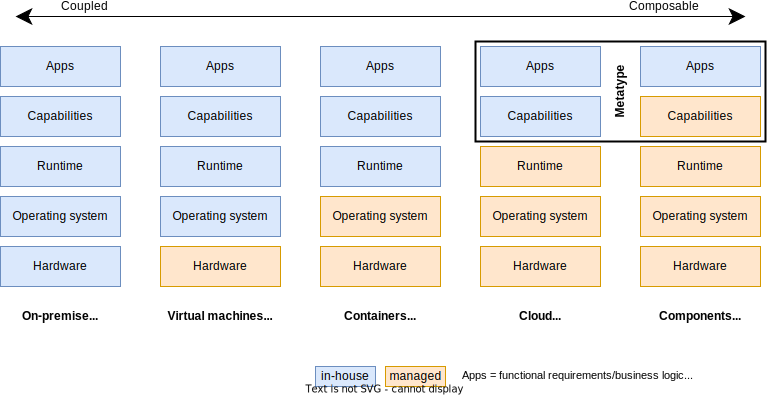
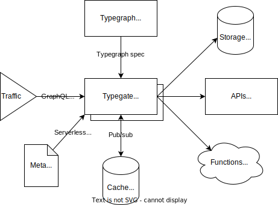

Metatype is an open source platform to author and deploy APIs for the cloud and components eras. It provides a declarative programming model that helps you to efficiently design APIs and focus on the functional requirements.

The runtime embraces WebAssembly (WASM) as a first-class citizen to allow you to write your business logic in the language of your choice and run it on-demand. Those "backend components" are reusable across your stacks and deployable without pipelines or containers.

The platform provides a set of capabilities out of the box:

- create/read/update/delete data in your database
- storing files in your cloud storage
- authenticate users with different providers or using JWTs
- connecting to third-party/internal APIs

And offers an opportunity to climb the one step higher in the abstraction ladder and drastically simplify the building of great APIs and systems!

 

Metatype is designed to be as simple as possible and horizontally scalable in existing container orchestration solution like Kubernetes. It consists of multiple parts, including:

- [**Typegraph**](/docs/reference/typegraph): a cross-language SDK to manage typegraphs - virtual graphs of types - and compose them
- [**Typegate**](/docs/reference/typegate): a serverless GraphQL/REST gateway to execute queries over typegraphs
- [**Meta CLI**](/docs/reference/meta-cli): a command-line tool to efficiently deploy the typegraphs on the gateway

