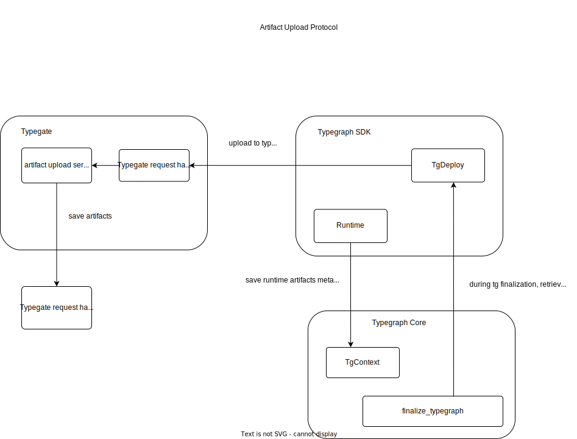

# Architecture

## Artifact Tracking Protocol

While developing and building an application using `Metatype`, different types of artifacts can be used in different parts of the application. An Artifact is an external file that your application uses as a dependency to do some task. For instance, while working with [PythonRuntime](/docs/reference/runtimes/python), we import an external `python` script `artifacts/hasher.py` which has some hashing functionality. The script which we imported will be marked as an `Artifact` and run inside the `PythonRuntime`. There can be numerous artifacts which can be used by different [Runtimes](/docs/reference/runtimes) inside Metatype. 

`Metatype` tracks these artifacts into two modes.
- `Single Replica` mode: which stores the artifacts inside the [Typegate](/docs/reference/typegate) node to which the [Typegraph](/docs/reference/typegraph) was deployed to. The artifacts will be persisited to the local file system of the typegate.
- `Sync` mode: which stores the artifacts in a cloud store. `S3` storage and `Redis` are a dependency in this mode. This will be useful when there are multiple typegate instances are running and they need to synchronize, and share artifacts. 

