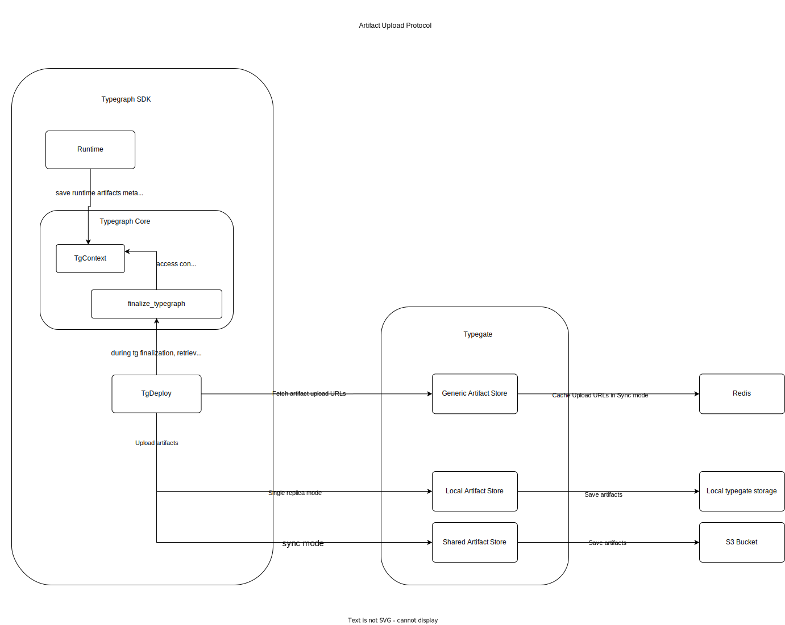

# Architecture

## Artifacts

While developing and building an application using _Metatype_, different types of artifacts can be used in different parts of the application. An artifact is an external file that your application uses as a dependency to execute tasks.

For instance, while working with [PythonRuntime](/docs/reference/runtimes/python), we import an external Python script `artifacts/hasher.py` which has some hashing functionality. The script which we imported will be marked as an artifact and run inside the `PythonRuntime`. There can be numerous artifacts which can be used by different [Runtimes](/docs/reference/runtimes) inside Metatype.

The way _Metatype_ tracks depends on the mode in which the typegate is running.

- In the _single-replica_ mode _(default)_, the artifacts are stored in only in the filesystem of the [Typegate](/docs/reference/typegate) node.
- In the [_Synchronized_ mode](/docs/reference/typegate/synchronization), they are stored in a shared S3-compatible object store.

### Reference counting

Artifacts are tracked using reference counts. After a successful upload, each artifact is assigned a zero reference count.

When a typegraph is deployed for the first time, the reference counts associated to each of its artifacts are incremented.

When a typegraph is updated, reference counts are updated according to the diff of the artifact list between new and old versions of the typegraph (list of artifact hashes): removal &rarr; decrementation, addition &rarr; incrementation, no change &rarr; no change.

When a typegraph is undeployed, the reference count of each artifact associated to the typegraph is decremented.

#### Rationale

Why do we use reference counts instead of removing unused artifacts after each typegraph update/undeployment?

- Artifacts are shared between typegraphs: multiple typegraphs from a single projects might share the same artifacts.
- We might have orphaned artifacts due to uncompleted typegraph process.

### Artifact removal

#### GC: Garbage collection

Artifacts that have a zero reference count are removed.

**Triggers:** The GC is triggerred at the end of each typegraph deployment/undeployment process.

#### Full GC

**_Not implemented_**

<!-- MET-498 -->

A full GC can be triggered manually with the _Meta CLI_ or on the console.

- Remove orphaned artifacts from uncompleted typegraph deployment process or uncompleted GC.
- Recompute all the reference counts, then run the GC. It might be necessary as the reference count might get wrong due to lack of a proper transaction support for the typegraph deployment/undeployment process.
