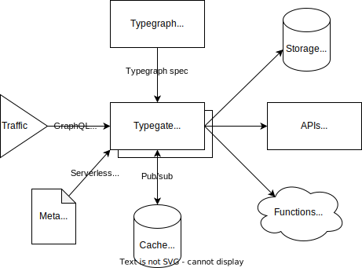

import Metatype from "../../../shared/metatype-intro.mdx";

# Mental model

This page gives a high-level view of Metatype's foundations.

:::tip Looking to build?
For a hands-on introduction, head over to the [metatype basics page](/docs/tutorials/metatype-basics) and start build your first typegraph.
:::

## Why does Metatype exist?

As products evolve, building APIs becomes a challenging hot spot where initiatives collides and efficiency becomes a struggle. While deploying new features, all developers spend a non-negligible amount of time on low-value added tasks (CRUD generation, data validation, authorization, etc.) and deploying their solutions. This leaves little time under business constraints to design great interfaces and experiment with the best technical solution, eventually increasing the time to delivery and weakening the innovation capabilities.

Metatype's vision is to enable everyone to build modular API with as little effort as possible. By helping developers to re-use existing systems and APIs, it enables teams to focus on what matters: their expert knowledge in business logic, modelling and technologies. Metatype manage the complex layers for them, making them productive and innovation-friendly for the next iterations.

Drawing inspiration from modern frontend development practices, Metatype adopts the pattern of composing components together to solve backend development challenges. In that respect, Metatype is a key element in the composable enterprise trend by:

- making system interfaces accessible and easy to understand for everyone (discoverability)
- embracing iterative approaches and cut time to deployment in half (autonomy)
- building strong foundations for APIs with type safety and bounded context (modularity)
- empowering teams to innovate with new technologies and interoperability (orchestration)

## How does Metatype work?

When developing a feature, the classical approach is to define what data will be at play, how to transform them, where the execution shall take place and who should be authorized. Instead, Metatype define an abstraction for each of those steps and put the emphasis on composing pre-defined APIs or defining re-usable ones when there is no existing solution.

|                       | Classical approach                  | Metatype's computing model                                                                 |
| --------------------- | ----------------------------------- | ------------------------------------------------------------------------------------------ |
| What (data)           | fixed response defined by the logic | API clients selects what they need from [types](/docs/concepts/mental-model#types)            |
| How (transformations) | ad-hoc code logic                   | composed data with interchangeable [materializers](/docs/concepts/mental-model#materializers) |
| Where (execution)     | 1 code base + 1 database            | orchestrate the request across multiple [runtimes](/docs/concepts/mental-model#runtimes)      |
| Who (authentication)  | hard-coded rules or system          | request context based and controlled by [policies](/docs/concepts/mental-model#policies)      |
| When (event)          | request arrival                     | based on [triggers](/docs/concepts/mental-model#triggers)                                     |

This computing model brings numerous advantages:

- it offers [multiple runtimes](/docs/reference/runtimes) with pre-defined operations and can replace the needs for an ad-hoc backend
- when the project grows, you easily introduce new APIs or break existing ones in smaller parts
- you write complex business logic directly in Typescript, Python or WebAssembly and run them on-demand
- third-parties APIs can be easily integrated, providing you visibility and control over them
- it is interoperable with existing (legacy) systems, and can be introduced step by step
- it can be easily self-hosted in your own infrastructure or customized according to your needs

## What's exactly Metatype?

<Metatype />

### Architectural overview

Metatype is designed for cloud environments and comes with minimal components. The only requirement to scale horizontally is to share some memory between replicas via Redis. You can use Metatype [helm chart](https://github.com/metatypedev/charts) to directly deploy typegates on your Kubernetes cluster.

import CodeBlock from "@theme/CodeBlock";
import MiniQL from "@site/src/components/MiniQL";
import gql from "graphql-tag";

# Typegraph

Typegraph is a [Python package](https://pypi.org/project/typegraph/) for building virtual graphs of types and managing their metadata. The name also refers to the [typegraph specification](/docs/reference/typegraph) which is a file format, currently in JSON, describing all elements of a typegraph.

:::info Why Python?
Python was historically chosen during Metatype's prototyping phase and remained since then the default way to describe typegraphs. Its great readability and dynamic typing make it a very accessible language for everyone to pick up quickly.

In theory, all frameworks and languages can produce typegraphs respecting the specification to become executable by typegates. This opens the door to a wide range of use cases, including generating typegraphs automatically from existing code base and tools.
:::

## Types

**Types** are the building block of typegraphs. They define a type system describing all data objects processed in Metatype. They can be easily extended to support new data types according to the needs of the application.

<CodeBlock language="python">{require("./types.py").content}</CodeBlock>

**Analogy in SQL**: types are similar to the Data Definition Language (DDL) with the extended capacity of describing any type of data.

## Materializers

Types can also describe functions and **materializers** define how the input type gets transformed into the output type. The input and output types are similar to a function signature and a materializer to its implementation, except that it might not always know what the function body is. In such case, the materializer knows at least where and how to access it.

<CodeBlock language="python">{require("./functions.py").content}</CodeBlock>

**Analogy in SQL**: a materializer is similar to a join, a function, or an alias.

## Runtimes

Every type and materializer have a runtime associated to it. This runtime describes where the types or materializers are physically located. It can be another API, a database, or any other services the typegate can connect to. The typegates uses that information to optimize the execution of the queries and minimize the amount of data moved.

In practice, materializers are often not explicitly used and the usage of runtime sugar syntax is preferred.

<CodeBlock language="python">{require("./runtimes.py").content}</CodeBlock>

**Analogy in SQL**: a runtime is similar to a database instance running some requests.

## Policies

Policies are a special type of function `t.func(t.struct({...}), t.boolean().optional())` attachable to any other type. They are evaluated once per request and determine whether one of the polices authorizes the access or not. They receive the request context (see [typegate](/docs/reference/typegate)) as argument allowing you to implement authorization, access control, or any other business logic.

The policy decision can be:

- `true`: the access is authorized
- `false`: the access is denied
- `null`: the access in inherited from the parent types

<CodeBlock language="python">{require("./policies.py").content}</CodeBlock>

**Analogy in SQL**: policies are similar to Row Security Policies (RSP) or Row Level Security (RLS) concepts.

## Triggers

Triggers are events launching the execution of one or multiple functions. They fire when a GraphQL request is received for the specific typegraph.

<CodeBlock language="python">{require("./triggers.py").content}</CodeBlock>

**Analogy in SQL**: a trigger is similar to receiving a new query.
