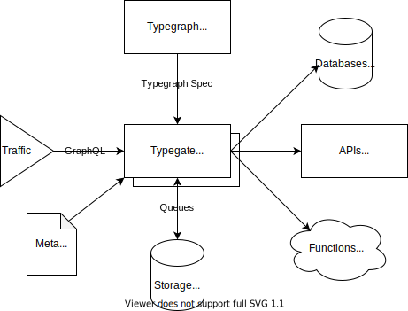

# Overview

This page gives a high-level description of what Metatype is and how it works.

:::info Looking to build?
For a hands-on introduction, head over to the [quick-start guide](/docs/tutorials/quickstart) to directly start build your first typegraphs.
:::

## What is Metatype ?

Metatype is a **composition ecosystem** for developers. It allows to build automonous, discoverable and modular API blocks on serverless orchestration.
These building blocks enable developers to iterate faster, remain agile as the stack grow and focus on domain design rather than its implementation.

The ecosystem consists of the following parts:

- [**Typegraph**](typegraph): a package to describe graphs of types and their compositions
- [**Typegate**](typegate): a fast and secure API-agnostic extensible gateway
- [**Meta**](meta): a CLI for developer experience (DX) and deployment

<div style={{textAlign: 'center'}}>



</div>

## Why Metatype ?

As a project/product/start-up evolves, the technological stack becomes a challenging place where iniatives collides and efficiency struggles. Especially:

- data objects are validated at multiple levels (e.g. front, back, storage, underlying services)
- hiring talented engineers become a [bottleneck](https://martinfowler.com/articles/bottlenecks-of-scaleups/02-talent.html)
- new API or data consumers arise (e.g. new partner/team/tools)
- technical debt become unhealthy [topics](https://martinfowler.com/articles/bottlenecks-of-scaleups/01-tech-debt.html)
- new features expand features and the modelling domains
- technological progress and innovation are constrainted by current state
- complexity and frictions decrease [developer experience](https://martinfowler.com/articles/developer-effectiveness.html)
- security and observability needs widen

Metatype provides an abstraction layer to enable API composition and tackle with agility the above scenarii.

| 5W1H                 | Specialized API    | Metatype                                     |
| -------------------- | ------------------ | -------------------------------------------- |
| Why (goal)           | project defined    | owned by clients                             |
| How (logic)          | server code        | compose with [materializers](#materializers) |
| What (content)       | server defined     | client selects from [types](#types)          |
| Where (execution)    | single environment | orchestrate [runtimes](#runtimes)            |
| Who (authentication) | hard-coded rules   | controlled by [policies](#policies)          |
| When (event)         | based on requests  | based on [triggers](#triggers)               |

### Types

A graph of types or typegraph defines a type system describing all data objects processed in Metatype. This data structure is the primary building block of the system and can be extended by the user.

```py
t.struct({
    "id": t.string().id,
    "age": t.integer(),
    "cars": t.struct({
        "name": t.string().s_optional()
    })
})
```

Taking the analogy of a Postgres database, this is similar to SQL's data definition language (DDL) and is not limited to tabular data.

### Materializers

The type system also supports first-order types which are specified by providing a materializer. This provides support for transforming between two types.

```py
t.func(t.struct({"name": t.string()}), t.string(), deno.FunMat("sayHello"))
```

The equivalent is SQL would be joins, functions or aliases.

### Runtimes

Materializers alone are not enough to perform the transformations. A materializer should also define in which runtime the transform will be operated.

In SQL, the runtime would be the database running the queries.

### Policies

Policies are a special type of materializer `t.struct({}) => t.boolean()` and can be attached to any type. It determines on evaluation whether one of the polices authorizes the callee to access it.

Row level security (RLS) is similar for a Postgres database.

### Triggers

Materializers can be triggered by a HTTP requests or any general purpose events.

## GraphQL support

Once a typegraph is defined, it can be projected to GraphQL and become compatible with GraphQL queries/mutations. This is the most convient way to interact with a typegraph for now. However the system could also support other query language and should not be limited to what GraphQL offers.
