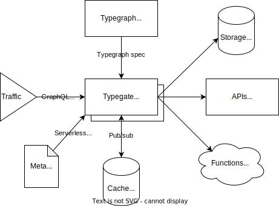

import Metatype from "../../../shared/metatype-intro.mdx";

# Overview

This page gives a high-level view of Metatype's foundations.

:::tip Looking to build?
For a hands-on introduction, head over to the [getting started page](/docs/tutorials/getting-started) and start build your first typegraph.
:::

## Why does Metatype exist?

As products evolve, building APIs becomes a challenging hot spot where initiatives collides and efficiency becomes a struggle. While deploying new features, all developers spend a non-negligible amount of time on low-value added tasks (CRUD generation, data validation, authorization, etc.) and deploying their solutions. This leaves little time under business constraints to design great interfaces and experiment with the best technical solution, eventually increasing the time to delivery and weakening the innovation capabilities.

Metatype's vision is to enable everyone to build modular API with as little effort as possible. By helping developers to re-use existing systems and APIs, it enables teams to focus on what matters: their expert knowledge in business logic, modelling and technologies. Metatype manage the complex layers for them, making them productive and innovation-friendly for the next iterations.

Drawing inspiration from modern frontend development practices, Metatype adopts the pattern of composing components together to solve backend development challenges. In that respect, Metatype is a key element in the composable enterprise trend by:

- making system interfaces accessible and easy to understand for everyone (discoverability)
- embracing iterative approaches and cut time to deployment in half (autonomy)
- building strong foundations for APIs with type safety and bounded context (modularity)
- empowering teams to innovate with new technologies and interoperability (orchestration)

## How does Metatype work?

When developing a feature, the classical approach is to define what data will be at play, how to transform them, where the execution shall take place and who should be authorized. Instead, Metatype define an abstraction for each of those steps and put the emphasis on composing pre-defined APIs or defining re-usable ones when there is no existing solution.

|                       | Classical approach                  | Metatype's computing model                                                                 |
| --------------------- | ----------------------------------- | ------------------------------------------------------------------------------------------ |
| What (data)           | fixed response defined by the logic | API clients selects what they need from [types](/docs/concepts/typegraph#types)            |
| How (transformations) | ad-hoc code logic                   | composed data with interchangeable [materializers](/docs/concepts/typegraph#materializers) |
| Where (execution)     | 1 code base + 1 database            | orchestrate the request across multiple [runtimes](/docs/concepts/typegraph#runtimes)      |
| Who (authentication)  | hard-coded rules or system          | request context based and controlled by [policies](/docs/concepts/typegraph#policies)      |
| When (event)          | request arrival                     | based on [triggers](/docs/concepts/typegraph#triggers)                                     |

This computing model brings numerous advantages:

- it offers [multiple runtimes](/docs/reference/runtimes) with pre-defined operations and can replace the needs for an ad-hoc backend
- when the project grows, you easily introduce new APIs or break existing ones in smaller parts
- you write complex business logic directly in Typescript, Python or WebAssembly and run them on-demand
- third-parties APIs can be easily integrated, providing you visibility and control over them
- it is interoperable with existing (legacy) systems, and can be introduced step by step
- it can be easily self-hosted in your own infrastructure or customized according to your needs

## What's exactly Metatype?

<Metatype />

### Architectural overview

Metatype is designed for cloud environments and comes with minimal components. The only requirement to scale horizontally is to share some memory between replicas via Redis. You can use Metatype [helm chart](https://github.com/metatypedev/charts) to directly deploy typegates on your Kubernetes cluster.

