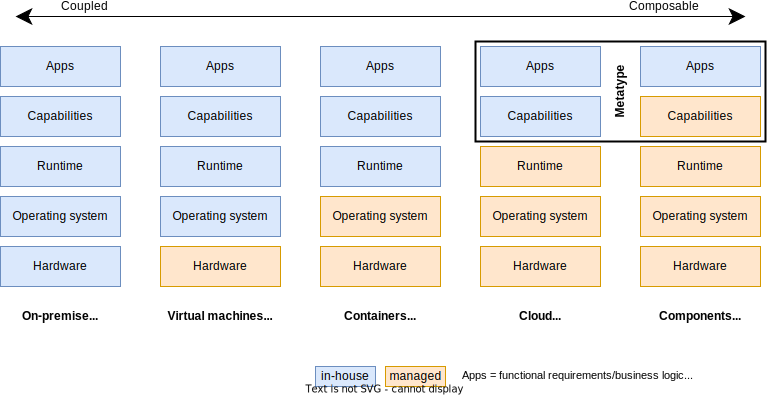

Metatype is an open source platform to author and deploy APIs for the cloud and components eras. It provides a declarative programming model that helps you to efficiently design APIs and delegate the non-functional requirements to the platform. Metatype currently supports Typescript/Javascript, Python and Rust.

The platform consists of multiple elements:

- [**Typegraph**](/docs/reference/typegraph): a multi-language SDK to manage typegraphs - virtual graphs of types - and compose them
- [**Typegate**](/docs/reference/typegate): a serverless GraphQL/REST gateway to execute queries over typegraphs
- [**Meta CLI**](/docs/reference/meta-cli): a command-line tool to securely and efficiently deploy the typegraphs on the gateway
- [**Meta LSP**](/docs/reference/meta-lsp): a language server protocol implementation to offer a great developer experience
