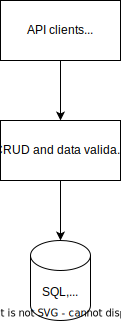

import TGExample from "@site/src/components/TGExample";

# Instant APIs on your database

CRUD stands for Create, Read, Update, and Delete, which are the four basic functions of persistent storage in a software application. Those operations are commonly used in combination with data validation to ensure that the stored data is correct and consistent.

## Case study

Let's say you are developing a web application for a retail store that allows customers to place orders online. In this scenario, you would need to use CRUD operations to create, read, update, and delete data related to orders, customers, products, and inventory.

You would have to model each of these entities as a data type, define the operations that can be performed on them and write the code to ensure the correctness of the data processed in the operations.

For example, you would need to define a `Customer` type with the following fields: `id`, `name`, `email`, and `address`. You would also need to define the operations that can be performed on the `Customer` type, such as `createCustomer`, `updateCustomer`, and `deleteCustomer`. You would also need to write the code to validate the data in the `createCustomer` operation to ensure that the customer's email address is valid and that the customer's address is not empty. Same for the other fields.

## Metatype's solution

Metatype simplifies the development of CRUD APIs by providing the [Prisma runtime](/docs/reference/runtimes/prisma) that automates the creation of the API for CRUD operations and corresponding data validation in PostgreSQL, MySQL, SQLite, SQL Server, MongoDB and CockroachDB. It can even validate some advanced types like email which may not be supported by downstream system (databases often store email address into plain string instead of a specialized field). This makes it faster for developers to create scalable CRUD APIs and enable them to focus their expertise where it matters most like checkout or the search capabilities.

<TGExample
  typegraph="prisma-runtime"
  python={require("../prisma-runtime.py")}
  query={require("../prisma.graphql")}
/>
