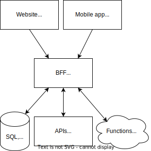

import TGExample from "@site/src/components/TGExample";

# Backend for frontend

Backend for frontend (BFF) is an architectural pattern in which each frontend client has a dedicated backend system. It enables client-specific customization of backend APIs with data transformations and optimizes requests by pre-fetching and caching data.

## Case study

Imagine you have a web frontend and a mobile app that both consume data from a (micro)services-based backend. The web frontend requires certain data fields in a format B, and the mobile app requires the same field plus additional ones in format B.

In a traditional architecture, both the web and mobile frontends would have to make separate API calls to the (micro)services, and then format the data into the appropriate structure themselves. This can lead to duplicated code, increased latency due heavier calls with non-necessary data, and decreased developer efficiency.

With a BFF in place, it handles the formatting of the data based on the specific needs of each client. All frontends can thus make a single API call to the BFF, which then communicates with the (micro)services, retrieves the data, and formats it into the required structure before returning it to the frontend.

## Metatype's solution

Metatype can act as a generic BFF component, serving multiple dedicated APIs and handling security, authentication and authorization for you. By encapsulating the logic for communicating with the (micro)services, Metatype helps to ensure that the frontends are as decoupled as possible from the other services, making it easier to make changes to either the frontend or the backend without affecting the other side.

<TGExample
  typegraph="backend-for-frontend"
  python={require("./typegraph.py")}
  query={require("./query.graphql")}
/>
