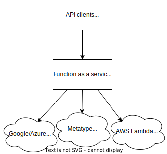

import TGExample from "@site/src/components/TGExample";

# Function-as-a-service runner

A Function-as-a-Service (FaaS) runner is a platform that allows developers to deploy and run small, single-purpose functions in the cloud. FaaS runners typically provide a serverless architecture, which means that developers do not have to worry about infrastructure management or the scaling, as the platform automatically handles these tasks.

## Case study

For example, imagine you have an e-commerce application that uses FaaS to process orders. When a customer places an order, multiple functions may need to be executed, such as validating the order, processing the payment, and updating the inventory.

Each function may be executed independently by the FaaS platform and may take varying amounts of time to complete. Those functions may also be executed for historical reason on different platforms like AWS Lambda, Google Cloud Functions, or Azure Functions.

To collect the results of all the functions in a timely manner, you need to ensure that each function is executed in the correct order and that you are not waiting for a slow function to complete before moving on to the next function.

## Metatype's solution

To solve the use case of executing multiple functions and collecting their results, Metatype provides two key features.

1. Function composition/chaining: functions can be chained together to form a pipeline. The output of one function can be used as the input of the next function in the pipeline. This allows us to execute multiple functions in a specific order.

2. Embedded runner: you can easily write a function that glues together multiple functions and executes them in a specific order. This allows you to execute multiple functions in a specific order. Currently, both Python and Typescript are supported.

<TGExample
  typegraph="faas-runner"
  python={require("./typegraph.py")}
  query={require("./query.gql")}
/>
