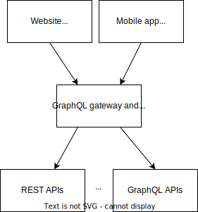

import TGExample from "@site/src/components/TGExample";

# Composable GraphQL server

GraphQL is a query language for APIs that was developed by Facebook in 2012 and open-sourced in 2015. It provides a more efficient, powerful, and flexible alternative to REST APIs by allowing clients to request only the data they need and enabling servers to expose a schema that defines the available data and operations.

## Case study

Suppose you are building a subscription platform with a GraphQL API. You need to design a schema that accurately represents the available products, their attributes, and the operations that clients can perform, such as searching, filtering, and sorting.

You also need to optimize the performance of complex queries that involve joining multiple data sources, such as products, categories, and user preferences. Additionally, you need to implement caching and pagination to improve the performance and scalability of your API.

Finally, you need to ensure that your API is secure and implements appropriate authentication and authorization mechanisms to protect sensitive data and operations. Some challenges like the N+1 problem (when a single query results in multiple nested queries, each of which requires a separate database or API call) can also make the development of GraphQL resolver slow and complex to manage.

## Metatype's solution

Metatype's approach is to focus on schema design solely, and leave the GraphQL resolver implementation to the engine. By providing where the data is stored and how to access it, the queries are optimized by the engine to minimize the number of external API/database calls and to cache the results.

This can be seen as a declarative GraphQL servers, where the server is orchestrated everything for you. Metatype also comes with pre-built functionalities like authentication, authorization, and rate limiting.

<TGExample
  typegraph="graphql-server"
  python={require("../../typegraphs/graphql-server.py")}
  query={require("./query.gql")}
/>
