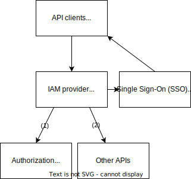

import TGExample from "@site/src/components/TGExample";

# IAM gateway

An Identity and Access Management (IAM) gateway is a core component of the cloud computing ecosystems. It provide an efficient and secure way to manage authentification for user identities and their authorized privileges within a system.

## Case study

Suppose a developer is building a social media platform that allows users to post updates and view other users' profiles. The developer wants to ensure that only authenticated users can access the platform's resources, and that each user can only access their own data.

To achieve this, the developer can use OAuth2 for user authentication and access control. OAuth2 allows users to log in using their Google or GitHub credentials, which are verified by Google or GitHub's IAM system. Once the user is authenticated, the social media platform can use OAuth2 to obtain an access token, which is used to authorize the user's access to the platform's resources.

The social media platform can also use IAM to control access to resources based on user roles and permissions. For example, only authenticated users can access the platform's resources, and each user can only access their own data.

## Metatype's solution

Metatype comes with a built-in IAM gateway that can be used to manage user identities and their authorized privileges within a system. It supports any OpenID/OAuth2 providers and includes a list of pre-configured ones like Google, GitHub, Facebook, Twitter or LinkedIn. You can also use your own identity provider and rely on JSON Web Tokens (JWT) for authentication.

Once the user is authenticated, you can use policy access based control (PBAC) to control access to resources based on user identifies and permissions. For example, only authenticated users can access the platform's resources, and each user can only access their own data. Policies can be defined by any function, and run on or off Metatype.

<TGExample
  typegraph="iam-provider"
  python={require("./iam-provider.py")}
  query={require("./query.gql")}
/>
