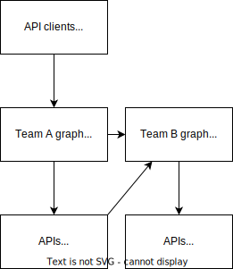

import TGExample from "@site/src/components/TGExample";

# (Micro)services orchestration

Microservices and small services are architectural styles for developing applications by breaking them down into small, independent services that can be deployed and scaled independently. Each micro or small service typically focuses on a specific business function or task, and communicates with other services through well-defined APIs.

## Case study

Let's say your company develop a healthcare platform and that one of the microservices is responsible for handling patient records (owned by team A), and another microservice is responsible for handling appointment scheduling (owned by team B).

When a patient schedules an appointment, the appointment scheduling microservice needs access to the patient's records to ensure that the appointment is scheduled with the right provider and that the provider has the necessary information to provide effective care. However, since patient records contain sensitive information, it is important to ensure that only authorized users have access to them.

To achieve this, the healthcare platform must use authentication and authorization on each API, which allows sharing only required information.

## Metatype's solution

Metatype can act as a central entry point for all incoming requests and responses between the microservices themselves and external clients. It is responsible for routing requests to the appropriate microservices and handling responses from those microservices, while verifying the authentication and authorization for each request.

Additionally, Metatype gateway can provide other important features such as rate limiting, caching, and request/response transformations. It can even provide an API from another typegraph and delegate the query processing to it.

<TGExample
  typegraph="team-a"
  python={require("./typegraph.py")}
  query={require("./query.gql")}
/>
