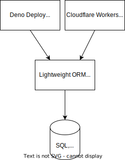

import TGExample from "@site/src/components/TGExample";

# ORM for the edge

Edge computing platforms like [Deno Deploy](https://deno.com/deploy) and [Cloudflare Workers](https://workers.cloudflare.com) can provide a convenient and scalable way for developers to deploy their applications and APIs near the end-users, improving performance, reducing latency, and enhancing the user experience. Due to the resource constraints and compatibility issues (legacy libraries or specific drivers) of those environments, running a traditional Object-Relational Mapping (ORM) library might not be as easy as in normal deployments.

## Case study

Suppose you are building a mobile app that allows users to order food from local restaurants. To provide a low-latency user experience, you want to run your server-side logic as close as possible to your users.

You can deploy your functions across multiple locations on distributed edge servers. For database interactions, you may need a lightweight relay API to remains compatible with the platform and offer an efficient interface like an ORM provide.

When a user makes a request to view the menu or place an order, the corresponding function running on the edge will make a request to the lightweight relay API to retrieve or modify the relevant data in the database.

## Metatype's solution

Metatype can act out of the box as a lightweight relay API, simplifying database interactions via HTTP/GraphQL requests, and allowing you to query your database through the [Prisma runtime](/docs/reference/typegraph/typegraph/providers/prisma/runtimes/prisma). Prisma is a well-known ORM library that provides a convenient interface to interact with PostgreSQL, MySQL, SQLite, SQL Server, MongoDB, CockroachDB databases.

<TGExample
  typegraph="prisma-runtime"
  python={require("../prisma.py")}
  query={require("../prisma.graphql")}
/>
