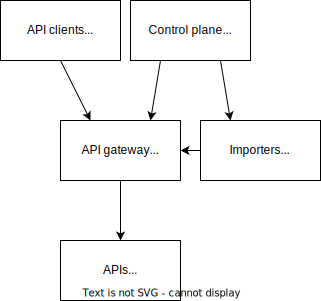

import TGExample from "@site/src/components/TGExample";

# Programmable API gateway

A programmable API gateway is an API gateway that provides a customizable framework for developers to create and deploy custom logic and policies for incoming requests and outgoing responses. Unlike traditional API gateways that provide a fixed set of features and policies, programmable API gateways offer a more flexible and extensible approach to managing APIs.

## Case study

Suppose that your company needs to implement various policies and logic to manage and secure its APIs, such as rate limiting, caching, and request/response transformations.

To achieve this, the company can adopt a programmable API gateway that allows developers to create and deploy custom function to implement additional logic and policies for incoming requests and outgoing responses.

It also provides a platform for the company to manage its API infrastructure more efficiently and flexibly. Developers can leverage existing libraries and frameworks to quickly build and deploy custom logic, reducing the time and effort required to develop and maintain the API gateway.

## Metatype's solution

Metatype provide a Python SDK for developers to create and deploy custom logic and policies, which can later be deployed to the gateway in a single command line. Importers can also be used to import existing API or logic definitions from other sources, such as OpenAPI, GraphQL, and gRPC.

This enables developer to quickly build and deploy any update the API or the business logic without having to worry about the underlying infrastructure.

<TGExample
  typegraph="programmable-api-gateway"
  python={require("./programmable-api-gateway.py")}
  query={require("./query.gql")}
/>
